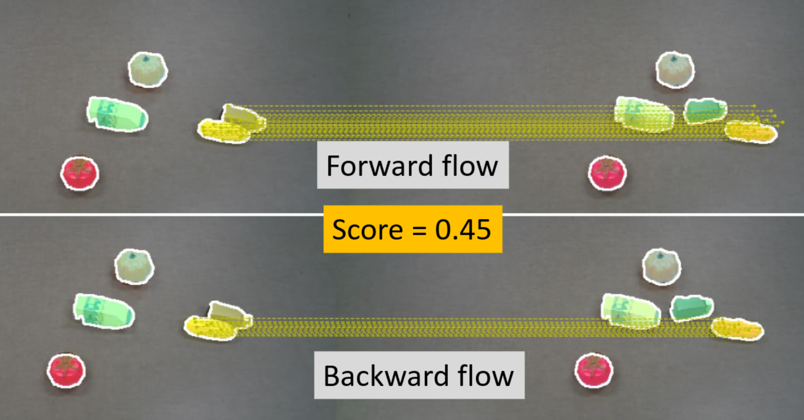
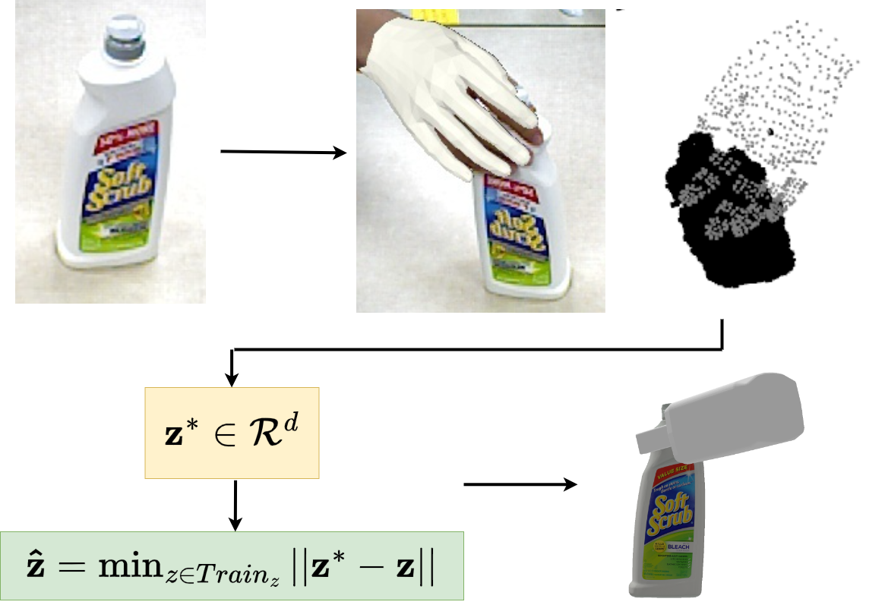

My main research focus is on robot manipulation methods, especially robust grasping. I am interested in developing generalizable grasp and manipulation methods which can scale well to unseen objects and gripper morphologies. I am currently trying to develop generative models for fast and accurate grasp synthesis. In addition to this, I am also interested in interactive perception based methods relating to real world unseen object segmentation.

## Service

I have served as a paper reviewer for the following:

- 2025: RA-L, IROS
- 2024: RA-L, IROS, CoRL, ACM MM
- 2023: ICRA, IROS, CoRL, ACM MM
- 2022: ICRA, IROS, ICMR, ICHI, ACM MM
- 2021: IEEE VR, ACM MM

Workshop Organization: [Neural Representation Learning for Robot Manipulation](https://neurl-rmw.github.io/),
[2023 Conference on Robot Learning](https://www.corl2023.org/)

## Teaching Assistance

- CS 4341: Digital Logic and Computer Design
- CS 4361: Computer Graphics
- CS 4395: Natural Language Processing
- CS/STAT 6313: Statistical Methods for Data Science
- CS 6301: Machine Learning (Special Topics in CS)
- CS 6301: Robotics (Special Topics in CS)

## Mentoring

- Working with two undergrad students on a research project around on the topic of
  Interactive Perception for object segmentation.
- Mentored six freshmen at IIT-Kanpur as part of my duties as a student guide in the
  Counselling Service of the institute.
- Volunteering as a "Peer Mentor" for incoming PhD students in the Engineering and Computer Sciences (ECS) school.

## Relevant Publications

{#paper-banner}
*RobotFingerPrint: Unified Gripper Coordinate Space for Multi-Gripper Grasp Synthesis* \
With F Casas, B Prabhakaran, Y Xiang \
*Under Submission* \
| [Arxiv](https://arxiv.org/pdf/2409.14519) | [Project Page](https://irvlutd.github.io/RobotFingerPrint/)

{#paper-banner}
*MultiGripperGrasp: A Dataset for Robotic Grasping from Parallel Jaw Grippers to Dexterous Hands* \
With F Casas, B Prabhakaran, Y Xiang \
In IEEE International Conference on Intelligent Robots and Systems (IROS) 2024 \
| [Arxiv](https://arxiv.org/abs/2403.09841) | [Project Page](https://irvlutd.github.io/MultiGripperGrasp/)

---

{#paper-banner}
*RISeg: Robot Interactive Object Segmentation via Body Frame-Invariant Features* \
With H Qian, Y Lu, K Ren, G Wang, Y Xiang, K Hang \
In IEEE International Conference on Robotics and Automation (ICRA) 2024 \
| [Arxiv](https://arxiv.org/abs/2403.01731) | \

----

{#paper-banner} 
*SceneReplica: Benchmarking Real-World Robot Manipulation by Creating Reproducible Scenes* \
With S Allu, Y Lu, J Jaykumar, B Prabhakaran, Y Xiang \
In IEEE International Conference on Robotics and Automation (ICRA) 2024 \
| [Arxiv](https://arxiv.org/abs/2306.15620) | [Project Page](https://irvlutd.github.io/SceneReplica/) | \

----

{#paper-banner}
*CIS2VR: CNN-based Indoor Scan to VR Environment Authoring Framework* \
With H Kumar, B Prabhakaran\
In IEEE International Conference on AI & extended and VR (AIxVR) 2024  \
| [DOI Link](https://doi.ieeecomputersociety.org/10.1109/AIxVR59861.2024.00025) | \

----

{#paper-banner}
*Self-Supervised Unseen Object Instance Segmentation via Long-Term Robot Interaction* \
With Z Xu, C Averill, K Palanisamy, K Hang, Y Guo, N Ruozzi, Y Xiang \
In Robotics: Science and Systems (RSS) 2023  \
| [Arxiv](https://arxiv.org/abs/2302.03793) | [Project Page](https://irvlutd.github.io/SelfSupervisedSegmentation/) | \

----

{#paper-banner}
*Skeletal Point Representations with Geometric Deep Learning* \
With B Paniagua, J Vicory \
In IEEE International Symposium on Biomedical Imaging (ISBI) 2023 (Oral) \
| [Arxiv](https://arxiv.org/abs/2303.02123) | [Code](https://github.com/kninad/skeleton-nn) | \

----

{#paper-banner}
*NeuralGrasps: Learning Implicit Representations for Grasps of Multiple Robotic Hands* \
With N Song, Z Xu, B Prabhakaran, Y Xiang \
In Conference on Robot Learning (CoRL) 2022 \
| [Arxiv](https://arxiv.org/abs/2207.02959) | [Project Page](https://irvlutd.github.io/NeuralGrasps/) | \

----

{#paper-banner}
*Virtepex: Virtual Remote Tele-Physical Examination System* \
With K Desai, B Prabhakaran, T Annaswamy \
In ACM Designing Interactive Systems Conference (DIS) 2022 \
| [DOI Link](https://doi.org/10.1145/3532106.3533486) | \

----

{#paper-banner}
*Generalized submodular information measures: Theoretical properties, examples, optimization algorithms, and applications* \
With R Iyer, J Bilmes, H Asanani \
In IEEE Transactions on Information Theory (ISIT) 2021 | [DOI Link](https://doi.org/10.1109/TIT.2021.3123944) \

----

{#paper-banner}
*Submodular combinatorial information measures with applications in machine learning* \
With R Iyer, J Bilmes, H Asanani \
In Algorithmic Learning Theory (ALT) 2021 \
| [JMLR Link](https://proceedings.mlr.press/v132/iyer21a.html) | [Arxiv](https://arxiv.org/abs/2006.15412) |

